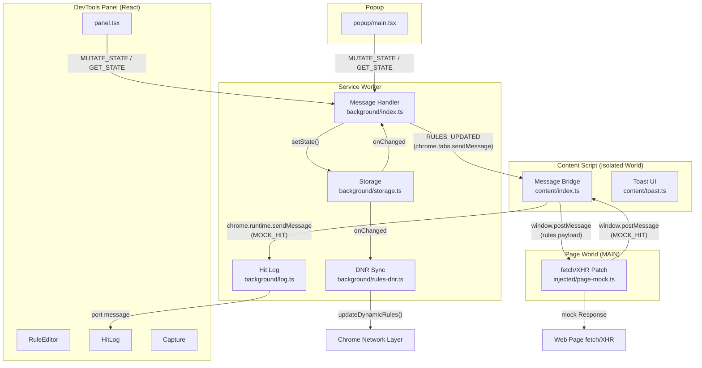

# Architecture

## Overview

Phantom Mock is a Chrome extension (Manifest V3) that intercepts and mocks HTTP requests in the browser. The architecture splits across four execution contexts — service worker, isolated-world content script, main-world page injection, and DevTools panel — connected by Chrome runtime messaging and `window.postMessage`.

The central abstraction is `AppState`: an immutable state object containing rules and groups, persisted to `chrome.storage.local`, mutated exclusively through the service worker, and broadcast to all contexts on change. Mock rules intercept `fetch`/`XHR` client-side; header rules are compiled to Chrome's `declarativeNetRequest` API for network-layer enforcement.

## High-level diagram

## Key abstractions

### AppState

Central state object persisted to `chrome.storage.local`. Contains `masterEnabled` flag, `groups[]`, and `rules[]`. All mutations flow through the service worker via `StateMutation` messages. Defined in `src/shared/types.ts`.

### Rule + MatchSpec + RuleAction

The core domain model. A `Rule` has a `MatchSpec` (URL pattern + HTTP method + match type) and a `RuleAction` (discriminated union: `MockAction` for response mocking, `HeaderAction` for header modification). Defined in `src/shared/types.ts`.

### StateMutation

Seven mutation types (`upsertRule`, `deleteRule`, `toggleRule`, `upsertGroup`, `deleteGroup`, `toggleGroup`, `setMasterEnabled`, `replaceState`) processed by `applyMutation()` in `src/background/index.ts`. Every state change goes through this path.

### RuntimeMessage

Typed message protocol for Chrome runtime messaging. Six message types: `GET_STATE`, `MUTATE_STATE`, `RULES_UPDATED`, `MOCK_HIT`, `GET_HIT_LOG`, `CLEAR_HIT_LOG`. Defined in `src/shared/messages.ts`.

### Rule Matcher

`specMatches()`, `isRuleActive()`, and `findFirstMockMatch()` in `src/shared/matcher.ts`. Used by both the page-world script (client-side interception) and the DNR translator (network-layer rules). First-match-wins ordering.

### Page-World Patch

`src/injected/page-mock.ts` runs in the MAIN world and replaces `window.fetch` and `XMLHttpRequest.prototype` methods. Receives rules from the content script via `window.postMessage`, matches against cached rules, and returns synthetic `Response` objects. Exposes `window.__phantomMock` debug API.

### DNR Translator

`src/background/rules-dnr.ts` converts `header`-type rules into `chrome.declarativeNetRequest` dynamic rules. Mock rules cannot be expressed in DNR (no response body synthesis), so they are handled exclusively client-side.

## Key directories

| Directory                  | Purpose                                                              |
| -------------------------- | -------------------------------------------------------------------- |
| `src/background/`          | Service worker — state management, DNR sync, hit logging             |
| `src/content/`             | Isolated-world content script — message bridge, toast UI             |
| `src/injected/`            | MAIN-world page injection — fetch/XHR patching                       |
| `src/devtools/`            | DevTools panel React app — rule editing, hit log, capture            |
| `src/devtools/components/` | UI components — RuleEditor, RulesTable, HitLog, Settings, JSON views |
| `src/devtools/capture/`    | Network capture tab — recording, HAR import, promote-to-rule         |
| `src/popup/`               | Browser-action popup — master toggle, domain-grouped rule counts     |
| `src/shared/`              | Cross-context types, messages, matcher, constants, preferences       |
| `src/utils/`               | Pure utilities — ID generation, string hashing                       |
| `tests/`                   | Vitest test files mirroring `src/` structure                         |
| `public/`                  | Static assets — extension icons (16/32/48/128px)                     |
| `store-assets/`            | Chrome Web Store listing screenshots and assets                      |

## External dependencies

Phantom Mock is entirely client-side with no backend, database, or third-party API calls.

| Dependency                     | Protocol             | Integration                                        |
| ------------------------------ | -------------------- | -------------------------------------------------- |
| `chrome.storage.local`         | Chrome Storage API   | `src/background/storage.ts`, `src/shared/prefs.ts` |
| `chrome.storage.session`       | Chrome Storage API   | `src/devtools/devtools.ts` (capture buffer)        |
| `chrome.declarativeNetRequest` | Chrome DNR API       | `src/background/rules-dnr.ts`                      |
| `chrome.devtools.network`      | Chrome DevTools API  | `src/devtools/devtools.ts` (HAR capture)           |
| `chrome.runtime`               | Chrome Runtime API   | Message passing across all contexts                |
| `chrome.tabs`                  | Chrome Tabs API      | `src/background/index.ts` (broadcast to tabs)      |
| `chrome.scripting`             | Chrome Scripting API | Permission declared for content script injection   |
