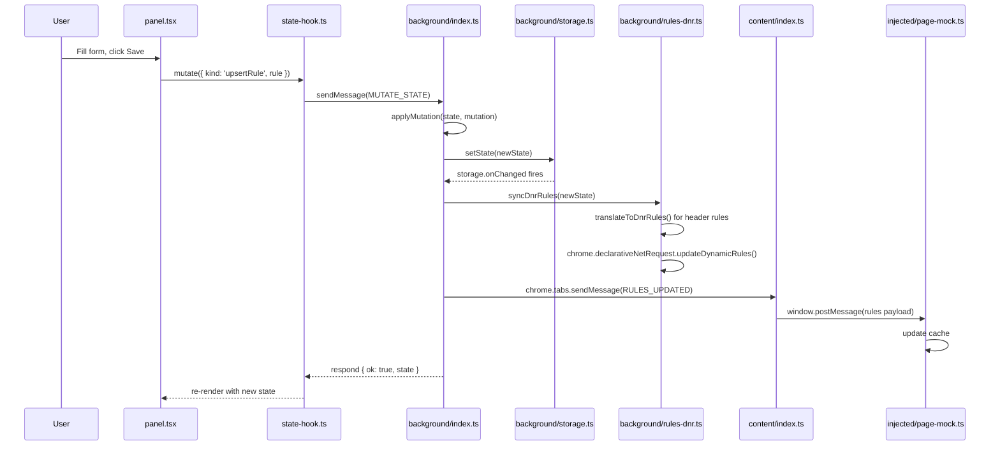
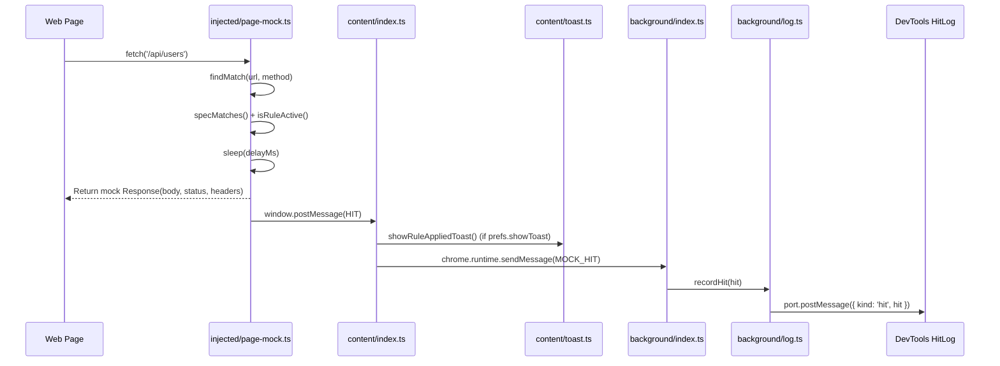
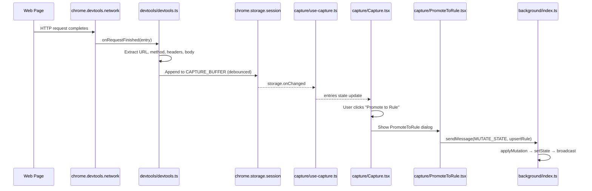

# Data Flow

The main user-facing pipelines, traced end-to-end.

## Pipeline 1: Create or edit a mock rule

User opens DevTools panel, edits a rule, clicks Save.

1. **Entry**: `devtools/panel.tsx` — user clicks Save, calls `mutate()` from `useAppState()`
2. **Hook**: `devtools/state-hook.ts::mutate()` — sends `MUTATE_STATE` message via `chrome.runtime.sendMessage()`
3. **Service worker**: `background/index.ts` — `applyMutation()` processes the mutation (upsertRule, deleteRule, toggleRule, etc.) and calls `updateState()`
4. **Storage**: `background/storage.ts::setState()` — writes to `chrome.storage.local`, triggers `onChanged` listener
5. **DNR sync**: `background/rules-dnr.ts::syncDnrRules()` — translates header-type rules to DNR format, calls `chrome.declarativeNetRequest.updateDynamicRules()`
6. **Broadcast**: `background/index.ts::broadcastRulesUpdated()` — sends `RULES_UPDATED` to all tabs via `chrome.tabs.sendMessage()`
7. **Content script**: `content/index.ts` — receives `RULES_UPDATED`, calls `postRulesToPage()` which sends rules via `window.postMessage()`
8. **Page world**: `injected/page-mock.ts` — receives message, updates in-memory `cache` with new rules/groups/masterEnabled

## Pipeline 2: Web page makes a request that matches a mock rule

A website calls `fetch()` or creates an `XMLHttpRequest` to a URL matching an active rule.

1. **Entry**: web page calls `fetch(url)` or `xhr.send()` — the patched version in `injected/page-mock.ts` intercepts
2. **Match**: `findMatch(url, method)` iterates cached rules; `isRuleActive()` checks master + group + rule enabled; `specMatches()` tests URL pattern (exact/contains/regex) and method
3. **Mock**: if matched and action is `mock` — applies `sleep(delayMs)`, constructs `Response` with `statusCode`, `responseBody`, `responseHeaders`, `responseContentType`
4. **Hit emit**: `emitHit()` posts `MockHit` to content script via `window.postMessage()`
5. **Content script**: `content/index.ts` receives hit, optionally shows toast via `showRuleAppliedToast()`, forwards `MOCK_HIT` message to service worker
6. **Log**: `background/log.ts::recordHit()` appends to circular buffer (max `MAX_HIT_LOG_ENTRIES`), broadcasts to all connected DevTools ports
7. **DevTools**: `HitLog` component receives hit via port listener, renders in UI

## Pipeline 3: Capture network traffic and promote to rule

User opens DevTools Capture tab, records traffic, then promotes a captured entry to a mock rule.

1. **Entry**: `devtools/devtools.ts` registers `chrome.devtools.network.onRequestFinished` listener
2. **Capture**: for each completed request, extracts URL, method, status, headers, body; calls `getContent()` for response body
3. **Buffer**: appends `CapturedEntry` to buffer in `chrome.storage.session` (max 100 entries, debounced 150ms)
4. **Hook**: `capture/use-capture.ts::useCapture()` subscribes to session storage changes, updates React state
5. **UI**: `capture/Capture.tsx` renders entries in a filterable grid with domain/subdomain grouping
6. **Promote**: user clicks "Promote to Rule" — `PromoteToRule.tsx` converts `CapturedEntry` fields to a `Rule` with field checkboxes and pattern presets
7. **Save**: promoted rule is sent as `MUTATE_STATE` to service worker, follows Pipeline 1 from step 3 onward
